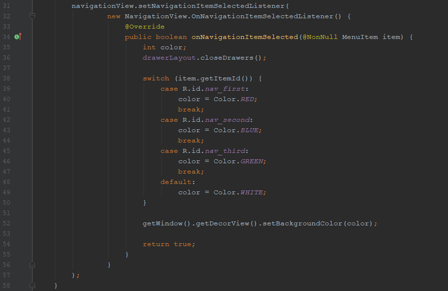
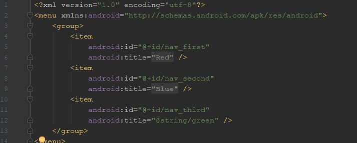
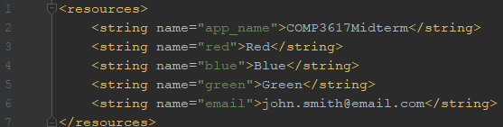

# COMP3617Midterm

## Navigation Drawer

To make a navigation drawer activity from scratch, follow this tutorial:
[Navigation Drawer Activity Tutorial](https://www.youtube.com/watch?v=urRzcA0vwDU)

To use this example, do the following:

1. Clone/Download this project

2. Under `MainActivity.java`, change the functionality of `onNavigationItemSelected()`.

    

    a) This is what determines what happens when an item is clicked.
  
        (ex: display a fragment, change background color, etc)

3. Under `drawer_content.xml`, change the title of each item to match the action.

    

    a) You will also need to add these strings to `strings.xml`.

4. If you wish to keep the drawer header, you can change the email text.

    

    a) You will need to change this in `strings.xml`.
